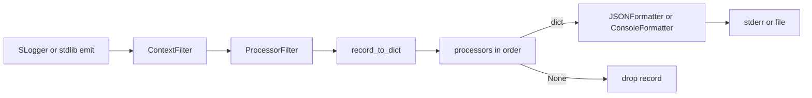

# Processor pipeline plan

Status: deferred. Kept for a future build; not scheduled.

## Goal

Let apps transform structured events once before they hit console/JSON sinks—redaction, sampling, static fields—without changing every `log.info(...)` call site.

## Design (chosen)

Run processors on the **flat dict** (the same shape as [`LogRecord`](../../src/slogger/schema.py)), not on the raw stdlib `logging.LogRecord`.



**Processor signature**

```python
Processor = Callable[[dict[str, Any]], dict[str, Any] | None]
```

- Return a (possibly modified) dict to keep the record.
- Return `None` to drop it (sampling / noise filters).
- Processors must not remove required schema keys (`timestamp`, `level`, `logger`, `message`, `file`, `func`, `line`); they may rewrite values (e.g. redact).

**Why a Filter, not only Formatter**

`Formatter.format` returning `""` still writes a blank line. Dropping must happen in a `logging.Filter`. Implementation:

1. New `src/slogger/processors.py`: type alias, built-ins, `run_processors(event, processors)`.
2. New `ProcessorFilter`:
   - On each record: `event = record_to_dict(record)` → run pipeline.
   - If `None`: return `False` (drop).
   - Else: stash on the record (e.g. `record.slog_processed = event`) and return `True`.
3. `JSONFormatter` / `ConsoleFormatter` use the stashed dict when present so the pipeline runs **once** even with multiple handlers; otherwise fall back to `record_to_dict`.

**Configuration**

Extend `configure(...)`:

```python
configure(
    ...,
    processors=[
        add_fields(service="checkout", env="prod"),
        redact(keys=["password", "token", "authorization"]),
        sample(rate=0.01, keep_levels=("WARNING", "ERROR", "CRITICAL")),
    ],
)
```

`configure` installs `ProcessorFilter(processors)` on every handler it attaches (same place it already adds `ContextFilter`). Filter order: `ContextFilter` first (inject span), then `ProcessorFilter`.

Default: `processors=()` — behavior unchanged.

## Built-in processors (v1)

| Helper | Behavior |
|---|---|
| `add_fields(**fields)` | Merge static keys; existing event keys win. |
| `redact(keys, replacement="***")` | Replace values for exact key matches (and `ctx_<key>` variants). Shallow only in v1. |
| `sample(rate, keep_levels=(WARNING, ERROR, CRITICAL), rng=None)` | Keep if level in `keep_levels` or `random() < rate`; else `None`. |
| `drop_keys(*keys)` | Remove listed user keys (must not remove required schema keys). |

Custom processors are plain functions:

```python
def drop_heartbeats(event):
    if event.get("message") == "heartbeat" and event.get("level") == "DEBUG":
        return None
    return event
```

## Usage examples

```python
import slogger
from slogger import add_fields, redact, sample

slogger.configure(
    level=slogger.INFO,
    json_file="app.log",
    processors=[
        add_fields(service="payments", version="1.4.0"),
        redact(keys=["password", "token", "authorization", "card"]),
        sample(rate=0.05),
    ],
)
```

## Files to touch (when built)

- New: `src/slogger/processors.py`
- `src/slogger/config.py` — `processors=` arg
- `src/slogger/formatters.py` — prefer stashed processed dict
- `src/slogger/__init__.py` — export helpers
- Tests: `tests/test_processors.py`
- Docs: README + CHANGELOG; optional `examples/processors.py`

## Out of scope for v1

- Per-handler processor lists
- Deep/recursive redaction
- Alternate renderers (logfmt/OTLP) as processors
- Changing the published JSON Schema
